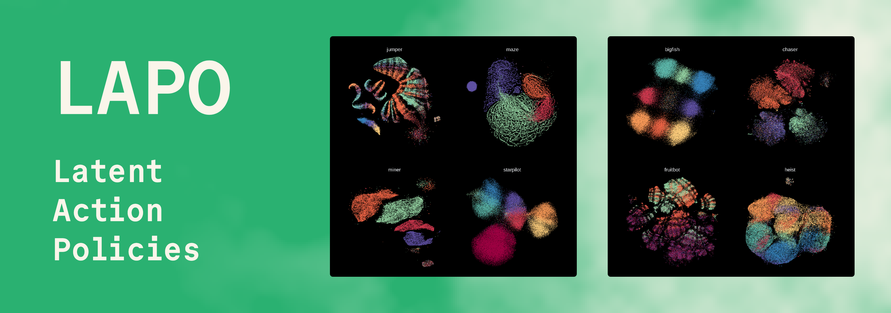

## Code for the ICLR 2024 Spotlight paper [“Learning to Act without Actions”](https://arxiv.org/abs/2312.10812)




<p align="center"><b>
  <a href="https://arxiv.org/abs/2312.10812" target="_blank">Paper (arXiv)</a> •
  <a href="https://drive.google.com/drive/folders/1XjpcfOm0NafPYFPnNtoHfhJ4nHVkQSB1">Dataset (Google Drive)</a>
</b></p>

### Overview

Pre-training large models on vast amounts of web data has proven to be an effective approach for obtaining powerful, general models in domains such as language and vision. However, this paradigm has not yet taken hold in reinforcement learning. This is because videos, the most abundant form of embodied behavioral data on the web, lack the action labels required by existing methods for imitating behavior from demonstrations. We introduce **Latent Action Policies** (LAPO), a method for recovering latent action information—and thereby latent-action policies, world models, and inverse dynamics models—purely from videos. LAPO is the first method able to recover the structure of the true action space just from observed dynamics, even in challenging procedurally-generated environments. LAPO enables training latent-action policies that can be rapidly fine-tuned into expert-level policies, either offline using a small action-labeled dataset, or online with rewards. LAPO takes a first step towards pre-training powerful, generalist policies and world models on the vast amounts of videos readily available on the web.


In stage 1, LAPO trains a _latent inverse dynamics model_ (IDM) to predict latent actions through a joint optimization process with a _latent world model_. As illustrated above, the world model needs to use the past observation + the latent action to predict the future observation. This results in a disentangled representation that captures state transition information in a highly-compressed manner.


In stage 2, LAPO trains a _latent action policy_ that imitates the latent actions predicted by the IDM. This results in an expert-level policy that produces actions in the latent space rather than the true action space.


In stage 3, the latent action policy is decoded to the true action space, either offline using a small action-labeled dataset, or online
through interaction with the environment. The diagram above is simplified—please see the paper and code for details.


### Setup instructions

We recommend using `python==3.11`. To install dependencies run:

```bash
pip install -r requirements.txt
```

Download the expert data for at least one of the 16 Procgen tasks from [here](https://drive.google.com/drive/folders/1XjpcfOm0NafPYFPnNtoHfhJ4nHVkQSB1) and place it in the `expert_data` directory. The `expert_data` dir should look like this:

```
expert_data
├── bigfish
│  ├── test
│  └── train
├── bossfight
│  ├── test
│  └── train
...
```
The data is provided as `.npz` files that contain chunks of trajectory data (observations, actions, logprobs, value estimates,...).

### Running experiments

To run stages 1-3 for all 16 Procgen games run:
```
cd lapo
bash launch.sh
```
> [!TIP]
> You can change hyperparameters by modifying the `lapo/config.yaml` file. The easiest way to look at the results is via [wandb](https://github.com/wandb/wandb): the project will log the results to your `lapo_stage1`, `lapo_stage1`, and `lapo_stage2` projects.

### Citation

If you are using LAPO, please consider citing our paper:

> [Dominik Schmidt, Minqi Jiang.<br/>
> **Learning to Act without Actions**<br/>
> *https://arxiv.org/abs/2312.10812*](https://arxiv.org/abs/2312.10812)


```
@inproceedings{lapo,
  title={Learning to Act without Actions},
  author={Schmidt, Dominik and Jiang, Minqi},
  booktitle={The Twelfth International Conference on Learning Representations (ICLR)},
  year={2024}
}
```
